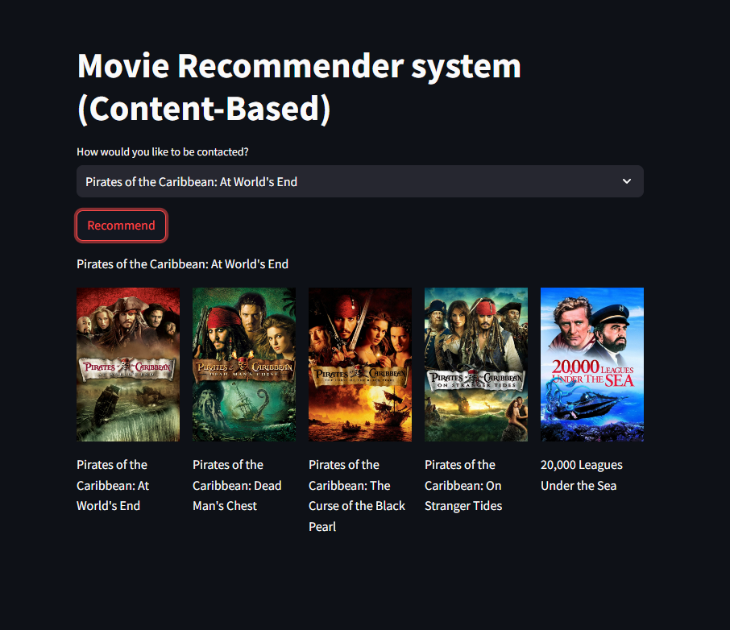
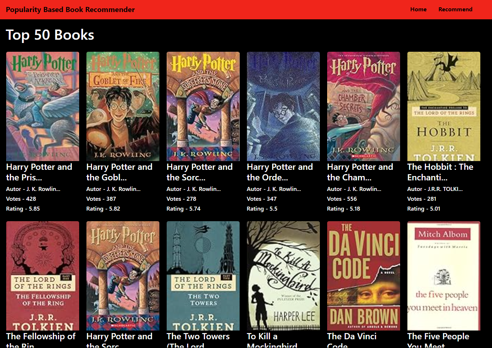
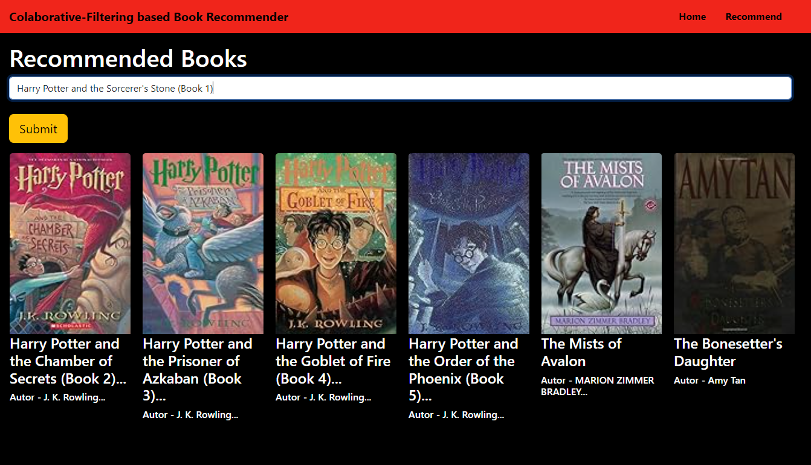
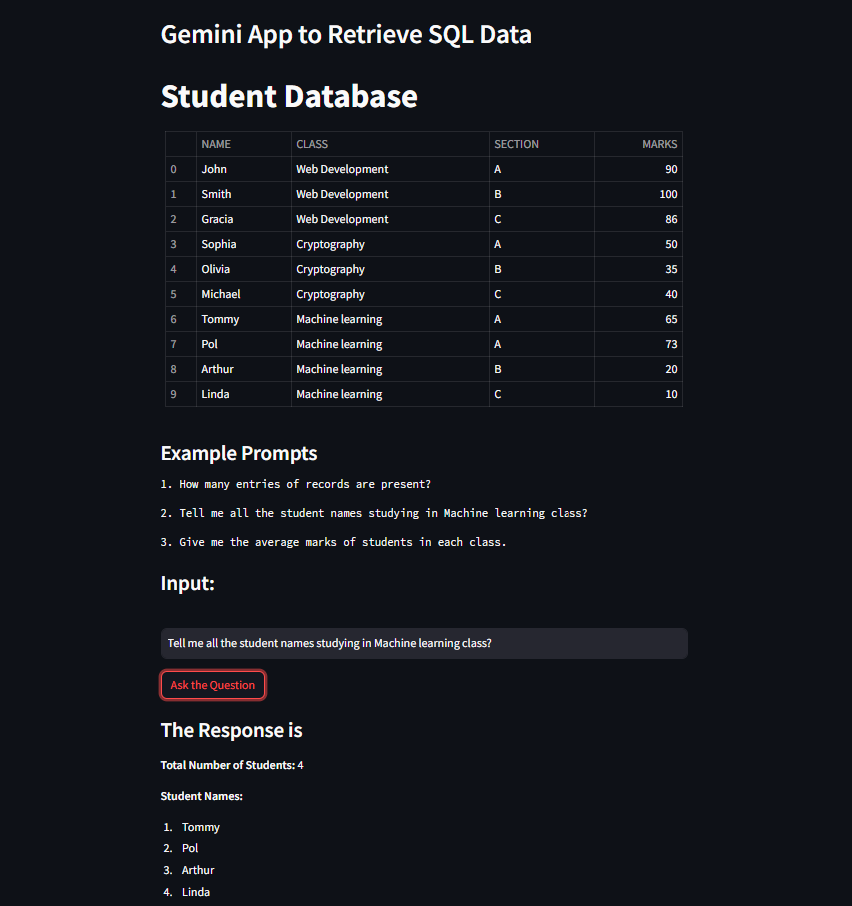

# ML_Projects

This repository contains machine learning projects I have worked on.


## Projects
### Project Name: [Recommender system](https://github.com/adkbbx/ML_Projects/tree/main/Recommendersystem)
Recommender systems are AI matchmakers, predicting what you'll love next based on your past clicks and likes. They keep you hooked on platforms by suggesting things you just can't resist.
1. **Movie recommender (Content-Based)**


2. **Book recommender (Popularity-Based)**


2. **Book recommender (Collaboraive-filtering-Based)**


### Project Name: [TexttoSQL_LLM_APP](https://github.com/adkbbx/ML_Projects/tree/main/TexttoSQL_LLM_APP)
Speak your data's language without memorizing a single SQL keyword. This application bridges the gap between human language and database queries, empowering anyone to effortlessly extract insights from databases. Effortlessly translate your questions into accurate SQL queries, even with complex conditions and nesting. 

Powered by: Google AI's Gemini LLM


## Installation

Steps to install and use the projects:

* Clone this repo.

```bash
  git clone https://github.com/adkbbx/ML_Projects.git
```

* Navigate into a project folder.

```bash
  cd PROJECT_NAME 
```

* Run scripts or notebooks for the project.
    
## Contributing


If you wish to contribute to any of the projects, please create a pull request detailing your changes.

## Authors

- [@adkbbx](https://www.github.com/adkbbx)

